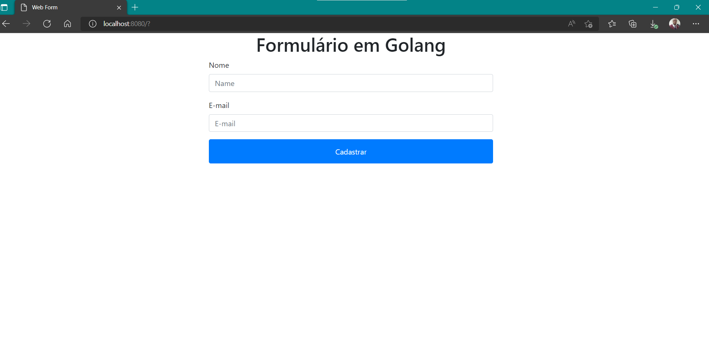

<h1 align="center">
Formulário Web em Golang
</h1>

Projeto disciplicar.

## Participantes

[Luciano Ribeiro](https://github.com/lucianorbr)

## Tecnologias

- [x] Go
- [x] MongoDB
- [x] HTML5
- [x] Booststrap

## O Projeto
- Projeto prático de criação de formulário web em Golang com MongoDB.

